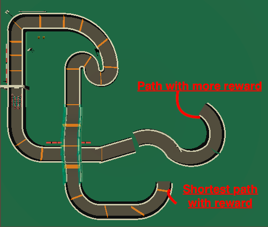
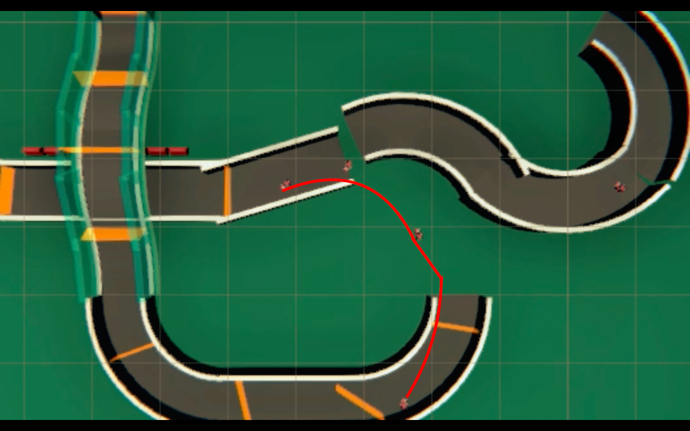

## Agents find the shortest path using the greedy approach

SAC is well known to have good exploration ability due to the entropy term in the objective function. Motivated by this, in this paper, a SAC-based path planning algorithm is proposed.

In this experiment, we will see that agents will explore and exploit their behavior.

## Environment 

After 100000 steps agents learns to take the shortest path.

## Results

Results are uploaded along with the model in the results folder.

## Future Study

Will be including Hindsight Expereince Replay

ML-Agents Release 10 with Unity 2019.4.9

## Credits
-- Many Thanks to Sebastian,Mix and Jam, Kenny ---

